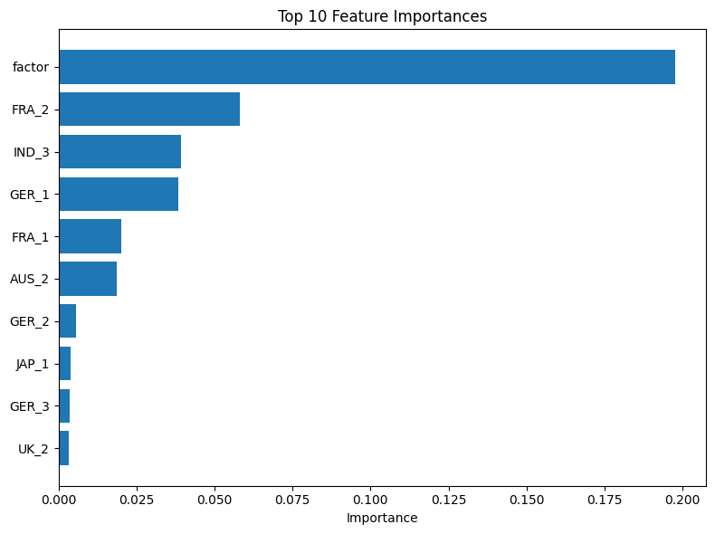

# Docstar1000 Demand Forecasting
This repo contains an end-to-end demand forecasting pipeline for Catapult Inc's Docstar 1000 spray. It covers data loading, preprocessing (country-scaling, outliear treatment), model training, hyperparameter tuning, inference and evaluation.

## Setup
1. Install poetry
``` curl -sSL https://install.python-poetry.org | python3 - ```
2. Install pre-commit hooks
``` pre-commit install```
3. Install dependencies
`poetry install`
4. Activate the virtual environment
 
## Run the End-to-End Pipeline
- Command: `poetry run python scripts/run.py`
- Modifications: change parameters in the `conf/config.yaml`
- Unit Tests: `poetry run pytest`

The E2E Pipeline will:
1. Load raw data and scaling factors
2. Split to train/holdout data using stratification on `"Sales"`
3. Treat Outliear using percentile clipping
4. Build a preprocessing pipeline with country-scaling, standardization, 1-Hot-Encoding for seasonal factors
5. Hyperparameter search using random search over the selected estimator
6. Evaluate on the holdout set with RMSE and R_squared
7. Display top feature importances

## Technical Summary

### Pipeline
Below is the core `Pipeline` structure:


1. Preprocessor (Pipeline)
- ColumnTransformer splits our inputs depending on the datatype of the features:
    - Numerical features (AUS_1, ..., UK_3)
        1) DemandScalingTransformer
            - Applies a country-specific multiplier (from our scaling_map) to each center’s demand forecast
            - Example: if USA’s factor = 1.5, then USA_1, USA_2, USA_3 are all multiplied by 1.5
        2) StandardScaler
            - This will be applied to each scaled demand column so that all numeric inputs live on a comparable scale
    - Categorical feature (factor)
        1) SimpleImputer
            - Fills any missing seasonal factor with the placeholder "missing".
        2) OneHotEncoder
            - Converts the factor levels (e.g. factor1, factor2,..., missing) into binary indicator columns (1 or 0), dropping one level to avoid collinearity.
2. Estimator
- XGBRegressor (or whichever algorithm you choose: LightGBM, RandomForest)
- Receives the preprocessed, feature-engineered matrix and learns to predict Sales.

### Evaluation Summary

- We can observe that the average error (RMSE) during hyperparameter tuning is 12.46, while the RMSE for the unseen holdout set is **12.43**
- This closeness indicates that the model is neither over- nor underfitting
- The target feature, `Sales`, ranges roughly from 300 to 1000 with a mean around 525 (see EDA notebook). An average error of 12.4 is about 2-3% of that mean which is fairly low
- The R_squared is 0.98 which means that the model explains about 98% of the variance in the holdout set Sales values.
- As expected, the feature with the highest importance is `factor` with a value of almost 0.2

